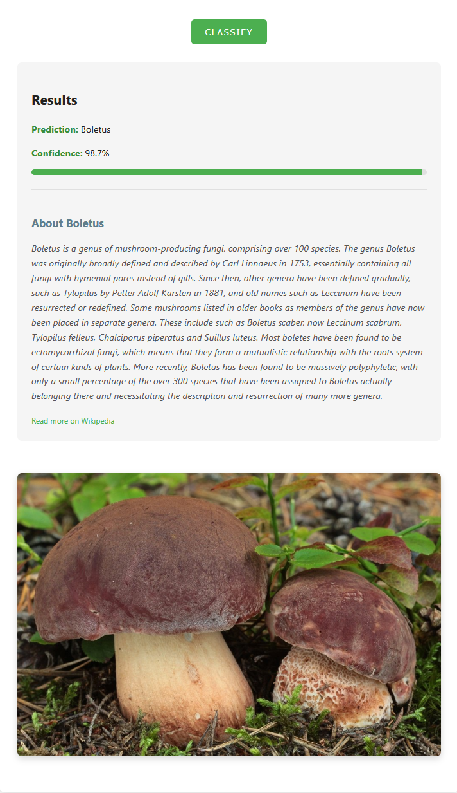

# Web application for Mushroom Genus Classification.

A deep learning model trained to classify mushroom genera using FastAI and ResNet50, based on Kaggle's mushroom dataset -> https://www.kaggle.com/code/yelloworld/mushrooms-classification.
Web application has been developed using Flask framework.

  

## Key Features
- **Model**: ResNet50 (transfer learning)
- **Dataset**: 6,714 mushroom images (5,367 train / 1,347 validation OOS)
- **Tech Stack**: FastAI, PyTorch, Flask (for web deployment)
- **Extras**: Wikipedia API integration for species descriptions

## Web startup
The web application runs locally. To start it, execute app.py, then open your browser and navigate to http://localhost:5000.
Make sure the HTML file is placed in the templates directory within the project folder.

## Installation
```bash
# Clone the repository
git clone https://github.com/hugmonke/MushroomGenusClassifier.git
cd MushroomGenusClassifier

# Install dependencies
pip install -r requirements.txt
